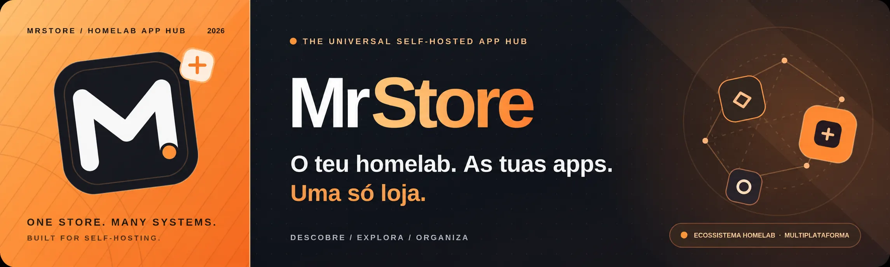

<div align="center">
  

  <h1>MrStore · Your Homelab App Hub</h1>

  <p><strong>O teu homelab. As tuas apps. Uma só loja.</strong><br>Descobre aplicações self-hosted num catálogo comunitário pensado para unir sistemas, servidores e plataformas. Uma identidade independente do teu sistema operativo.</p>

  <p>
    <a href="https://mrpiracy94.github.io/MrStore/"><strong>🌐 Explorar a loja</strong></a>
    &nbsp; · &nbsp;
    <a href="#-uma-marca-para-todo-o-homelab"><strong>🌍 Ecossistema</strong></a>
    &nbsp; · &nbsp;
    <a href="#-segurança-e-transparência"><strong>🛡️ Segurança</strong></a>
    &nbsp; · &nbsp;
    <a href="https://github.com/mrpiracy94/MrStore/issues"><strong>💬 Issues e sugestões</strong></a>
  </p>
</div>

---

## ✨ O que é a MrStore?

A **MrStore** é uma montra comunitária de aplicações **self-hosted** concebida para o universo homelab — independentemente da marca do NAS, servidor ou plataforma. Organiza **254 definições de aplicações** baseadas em Docker Compose. O catálogo público pode disponibilizar **menos aplicações**, porque a publicação exclui as que não passaram os controlos de segurança.

**Estado técnico atual:** o adaptador de loja disponível neste repositório utiliza o protocolo **ZimaOS App Store v2**. O suporte de instalação nativa noutros sistemas faz parte do desenvolvimento futuro.

| 🔍 Exploração fácil | 📦 Aplicações self-hosted | 🛡️ Segurança por aplicação |
|:---|:---|:---|
| Pesquisa por nome, categoria, arquitetura e favoritos na montra web. | Catálogo de origem organizado por categorias, com IDs estáveis. | Verificação das imagens Docker, digest imutável e quarentena de resultados vulneráveis ou inconclusivos. |

**[Abrir a montra da MrStore →](https://mrpiracy94.github.io/MrStore/)**

> **Nota:** a montra em GitHub Pages é uma interface informativa. Não instala aplicações automaticamente. A nova interface só fica disponível publicamente após uma publicação segura e bem-sucedida na branch `gh-pages`. Se estiver publicada uma edição anterior, consulta os avisos e relatórios antes de instalar.

## 🌍 Uma marca para todo o homelab

A **MrStore** pretende ser um ponto de descoberta de aplicações self-hosted para diferentes ambientes. O objetivo futuro abrange **UmbrelOS, Homeio, CasaOS, ZimaOS, Cosmos, Portainer, HomeDock OS, Olares, Dockge, Runtipi e Docker/Linux**.

> **Estado de compatibilidade:** estes nomes representam **plataformas-alvo**, não integrações já concluídas. Atualmente, o formato de catálogo e as instruções de instalação disponibilizadas neste repositório são específicos do **ZimaOS App Store v2**. Não assumas que o URL da loja funciona diretamente nos restantes sistemas.

## 🚀 Adicionar ao ZimaOS

1. Abre a App Store do teu ZimaOS e procura a opção de **adicionar uma loja externa** compatível com o protocolo v2.
2. Adiciona o endereço abaixo (URL base da loja):

   ```text
   https://mrpiracy94.github.io/MrStore
   ```

3. Consulta o catálogo e verifica requisitos, permissões, arquitetura suportada e dados persistentes antes de instalar uma aplicação.

Os ficheiros oficiais continuam disponíveis em [store.json](https://mrpiracy94.github.io/MrStore/store.json) e [index.json](https://mrpiracy94.github.io/MrStore/index.json).

**Atenção:** não há garantia de instalação e atualização funcional em todas as versões do ZimaOS. Os testes reais no dispositivo são distintos dos testes estáticos efetuados pelo GitHub Actions.

**Cobertura de testes reais:** cada aplicação tem agora uma linha no relatório gerado por `python scripts/zimaos_coverage.py`, separado por AMD64/ARM64. O registo de evidências encontra-se em [data/zimaos-device-tests.json](data/zimaos-device-tests.json); **sem registo não significa sem testes**, e a CI não considera testes estáticos como provas de funcionamento. Consulta [como documentar ensaios reais](docs/ZIMAOS_COMPATIBILITY.md#inventário-completo-de-evidências-por-aplicação-c2c4).

## 🧭 Descobrir aplicações

A montra web foi concebida para facilitar o uso:

- **Pesquisar** por nome, descrição e categoria.
- **Filtrar** por categoria e arquitetura AMD64/ARM64.
- **Guardar favoritos** localmente no navegador, sem criar conta.
- **Consultar fichas** com a versão do pacote, serviço e link para o manifesto Docker.
- **Distinguir publicação verificada de edições antigas**, com alertas caso o relatório de seleção segura esteja ausente.

Para ver todos os manifests da origem, incluindo os que possam estar em quarentena, consulta a pasta [Apps/](Apps/).

## 🧩 MrStore Universal — 11 ecossistemas

A MrStore passa a apresentar **11 sistemas** num único catálogo, sem
duplicar os 254 manifests de origem. Os downloads universais são gerados
**apenas a partir do release aprovado** pela auditoria de imagens Docker.
A compatibilidade *por Compose* não equivale a integração de loja nativa.

| Integração | Estado |
|---|---|
| ZimaOS | Loja v2 existente, mantida |
| Homeio / CasaOS | Fonte ZIP experimental (sem certificação de runtime) |
| Portainer | Templates JSON v2 restritos a apps de contentor único + Compose |
| Cosmos / Dockge / Docker Linux | Manifestos Compose aprovados, importação manual |
| HomeDock OS | Gerador experimental de pacotes .hds e loja .hdstore, sujeitos a testes reais |
| umbrelOS | ZIP-semente de loja Git para apps simples; precisa de repo separado |
| Runtipi | ZIP-semente de loja Git v4+ para apps simples; precisa de repo separado |
| Olares | Gerador experimental OAC 0.12/Helm para subset elegível; testes Kubernetes/Market pendentes |

O novo seletor no website explica o método por sistema e, quando a publicação
inclui evidência coincidente, disponibiliza o manifesto Compose aprovado
diretamente na ficha de cada aplicação.

Depois de um release filtrado, ficam também disponíveis os pacotes
experimentais [HomeDock `mrstore.hdstore`](https://mrpiracy94.github.io/MrStore/homedock/mrstore.hdstore)
e [Olares `olares-oac-preview.zip`](https://mrpiracy94.github.io/MrStore/olares/olares-oac-preview.zip).
Estes URLs **não estão garantidamente publicados** enquanto a PR não for
testada, aprovada e integrada, e **não são certificações de instalação real**.
As assinaturas HomeDock são checksums SHA-256 de integridade, não uma
identidade criptográfica autenticada do publicador.

O relatório público [`support-report.json`](https://mrpiracy94.github.io/MrStore/universal/support-report.json)
passará a apresentar a contagem de **formatos elegíveis** em cada um dos 11
destinos, com certificações reais a zero até existir evidência de instalação
e atualização. Um pacote opcional que não corresponda ao release auditado é
retirado da publicação, sem afetar a loja ZimaOS.

**[Matriz completa e estado por plataforma](docs/UNIVERSAL_PLATFORMS.md)** ·
[Plano CasaOS/Homeio](docs/UNIVERSAL_COMPATIBILITY.md) ·
[Política de publicação segura](docs/SAFE_RELEASE_POLICY.md)


## 🛡️ Segurança e transparência

A MrStore não considera uma imagem segura simplesmente por constar da lista. O processo de publicação deve:

1. Resolver as referências Docker para **digests imutáveis**.
2. Auditar as arquiteturas declaradas (**AMD64 e/ou ARM64**) com Trivy.
3. Exigir **zero HIGH e CRITICAL conhecidos** no relatório completo, sem falhas de scanner nem plataformas em falta.
4. Bloquear configurações inseguras, segredos por configurar e imagens descontinuadas quando aplicável.
5. Publicar apenas a seleção aprovada, documentando as aplicações em quarentena.

**Não afirmamos ausência absoluta de CVEs.** A publicação pública só está comprovada como filtrada quando existe um `release-status.json` coerente com o índice efetivamente publicado. Falhas de auditoria não equivalem a resultados limpos.

📖 [Política de publicação segura](docs/SAFE_RELEASE_POLICY.md) · [Compatibilidade real ZimaOS](docs/ZIMAOS_COMPATIBILITY.md) · [Avisos de segurança](SECURITY.md)

## ⚙️ Tecnologias e automação

| Componente | Finalidade |
|:---|:---|
| **ZimaOS App Store v2** | Gerar o catálogo através do builder oficial. |
| **Docker Compose** | Definir as aplicações, serviços, volumes e portas. |
| **Python + PyYAML** | Validar metadados, arquiteturas, segurança e catálogos. |
| **Trivy + crane** | Auditar vulnerabilidades e consultar digests das imagens. |
| **GitHub Actions** | Verificações, testes de regressão, monitorização e publicação. |
| **HTML + CSS + JavaScript** | Montra leve e responsiva no GitHub Pages, sem dependências CDN. |

## 🗂️ Estrutura do projeto

```text
MrStore/
├── Apps/                 # 254 manifests de origem; não são todos necessariamente publicáveis
├── web/                  # Montra e recursos visuais GitHub Pages
│   ├── index.html
│   └── assets/
├── scripts/              # Validação, auditoria CVE, publicação e monitorização
├── security/images/      # Imagens de segurança corrigidas quando justificadas
├── tests/                # Testes offline e regressões
├── docs/                 # Guias, política de segurança e migrações
├── .github/workflows/    # Validação CI, publicação e verificações programadas
├── category-list.json
├── recommend-list.json
└── store-config.json
```

## 🧪 Desenvolvimento e testes

```bash
python -m pip install -r requirements.txt
python scripts/validate.py
python -m unittest discover -s tests -v
python scripts/compatibility.py
```

A montra web é integrada pelo `scripts/stage_storefront.py` **apenas depois** de o builder oficial criar os JSON v2 e de o relatório da seleção aprovada ser validado. Não substitui `store.json`, `index.json` nem os Compose das aplicações.

📖 [Como funciona a montra](docs/STORE_FRONTEND.md) · [GitHub Actions](https://github.com/mrpiracy94/MrStore/actions) · [Compatibilidade ZimaOS](docs/ZIMAOS_COMPATIBILITY.md)

---

<div align="center">
  <strong>MrStore</strong> · Feita para a comunidade, com paixão por self-hosting. 🧡<br>
  <sub>Projeto não oficial, sem afiliação à IceWhaleTech ou aos programadores das aplicações.</sub>
</div>
